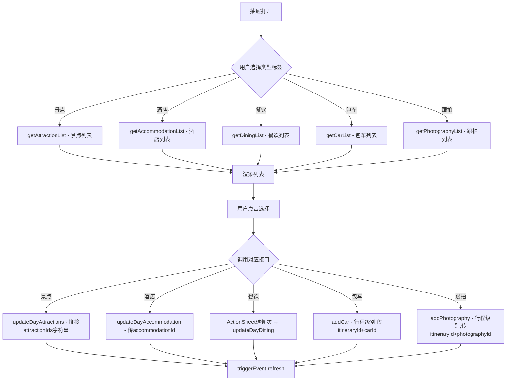

# 行程页面实现方案

## 1. 文件结构

```
miniprogram/
├── pages/
│   ├── create-itinerary/
│   │   ├── index.ts
│   │   ├── index.wxml
│   │   ├── index.scss
│   │   └── index.json
│   └── itinerary-detail/
│       ├── index.ts
│       ├── index.wxml
│       ├── index.scss
│       └── index.json
├── components/
│   ├── base-drawer/              # 抽屉基础组件(root-portal+transition+遮罩)
│   ├── add-schedule-drawer/
│   ├── attraction-card/
│   ├── hotel-card/
│   ├── dining-card/
│   ├── car-card/
│   ├── photography-card/
│   ├── hotel-intro-drawer/
│   ├── dining-intro-drawer/
│   ├── car-intro-drawer/
│   ├── photography-intro-drawer/
│   └── attraction-intro-drawer/
```

**命名规范**（与项目现有组件一致）：每个组件目录内文件以组件名命名，如 `base-drawer/base-drawer.ts`、`base-drawer/base-drawer.wxml`、`base-drawer/base-drawer.scss`、`base-drawer/base-drawer.json`。页面文件仍用 `index.*`。

## 2. 核心数据流

```mermaid
sequenceDiagram
    participant User as 用户
    participant Create as 创建行程页
    participant API as 后端API
    participant Detail as 行程详情页
    participant Drawer as 日程抽屉
    participant Intro as 简介抽屉

    User->>Create: 填写行程信息(省/市/区+日期+偏好)
    Create->>API: autoGenerateItinerary(ItineraryParams)
    API-->>Create: AjaxResult<Itinerary>
    Create->>Detail: wx.redirectTo({url: '...?id=' + res.data.itineraryId})
    
    Detail->>API: getItinerary(itineraryId)
    API-->>Detail: AjaxResult<Itinerary>(含daysList及关联实体)
    
    User->>Detail: 点击"Add Spot"
    Detail->>Drawer: 打开添加日程抽屉(传入dayNumber, itineraryId)
    User->>Drawer: 选择类型标签(景点/酒店/餐饮/包车/跟拍)
    Drawer->>API: getAttractionList/getAccommodationList/getDiningList/getCarList/getPhotographyList
    API-->>Drawer: 对应实体列表(TravelAttraction[]/TravelDining[]等)
    User->>Drawer: 选择某项
    Drawer->>API: updateDayAttractions/updateDayAccommodation/updateDayDining/addCar/addPhotography
    API-->>Drawer: 更新成功
    Drawer->>Detail: triggerEvent('refresh')
    Detail->>API: getItinerary(itineraryId) 刷新数据

    User->>Detail: 点击卡片展开按钮
    Detail->>Intro: 打开对应简介抽屉(传入详情数据)
```

## 3. 页面设计

### 3.1 创建行程页面 (pages/create-itinerary)

**职责**：收集用户行程偏好，调用AI生成接口，成功后跳转详情页。

**data 结构**：

```typescript
{
  provinceCode: string;         // 省编码
  cityCode: string;             // 市编码
  districtCode: string;         // 区编码
  provinceName: string;         // 省名称(用于显示)
  cityName: string;             // 市名称(用于显示)
  districtName: string;         // 区名称(用于显示)
  startDate: string;            // 开始日期
  endDate: string;              // 结束日期
  travelerType: 'solo' | 'couple' | 'family' | 'friends';
  preferences: string[];        // 旅行偏好标签(已选dictValue)
  preferenceOptions: DictData[]; // 偏好选项列表
  blindMode: 'full' | 'clear';
  loading: boolean;
}
```

**关键逻辑**：

- 目的地选择：调用 `getRegionTree()` 获取省市区树形数据，或分级调用 `getProvinces()` → `getCities(provinceCode)` → `getDistricts(cityCode)`
- 日期选择：使用小程序内置 `picker` mode="date" 组件
- 偏好标签：通过 `getDictByType('travel_tourist_like')` 获取可选标签列表
- 天数计算：

  ```typescript
  calculateDays(): number {
    const start = new Date(this.data.startDate).getTime();
    const end = new Date(this.data.endDate).getTime();
    return Math.max(1, Math.ceil((end - start) / (1000 * 60 * 60 * 24)) + 1);
  }
  ```

- AI智能规划按钮（注意：AI生成耗时较长，全局默认 timeout 已改为 60s）：

  ```typescript
  async onAIPlan() {
    this.setData({ loading: true });
    try {
      const res = await autoGenerateItinerary({
        province: this.data.provinceName,
        city: this.data.cityName,
        district: this.data.districtName,
        startDate: this.data.startDate,
        days: this.calculateDays(),
        remark: JSON.stringify({
          travelerType: this.data.travelerType,
          preferences: this.data.preferences,
          blindMode: this.data.blindMode
        })
      });
      wx.redirectTo({
        url: `/pages/itinerary-detail/index?id=${res.data.itineraryId}`
      });
    } catch (err) {
      wx.showToast({ title: '生成失败，请重试', icon: 'none' });
    } finally {
      this.setData({ loading: false });
    }
  }
  ```

  > **等待体验优化**：loading 期间应展示进度提示文案（如"AI正在为您规划行程，预计需要30~60秒..."），禁用按钮防止重复点击，调用 `wx.setKeepScreenOn({ keepScreenOn: true })` 防止息屏导致请求中断。

- 自主规划按钮：调用 `addItinerary(params)` 接口（`POST /wx/itinerary/add`），创建空行程框架后跳转详情页：

  ```typescript
  async onManualPlan() {
    this.setData({ loading: true });
    try {
      const res = await addItinerary({
        province: this.data.provinceName,
        city: this.data.cityName,
        district: this.data.districtName,
        startDate: this.data.startDate,
        days: this.calculateDays(),
      });
      wx.redirectTo({
        url: `/pages/itinerary-detail/index?id=${res.data.itineraryId}`
      });
    } catch (err) {
      wx.showToast({ title: '创建失败，请重试', icon: 'none' });
    } finally {
      this.setData({ loading: false });
    }
  }
  ```

**WXML 结构要点**：

```xml
<view class="page-container">
  <navigation-bar title="创建行程" back="{{true}}" color="black" background="#F9FAF4" />
  <view class="hero">...</view>
  <scroll-view scroll-y class="content">
    <!-- 目的地(省市区级联) -->
    <!-- 日期+人数 -->
    <!-- 偏好标签 -->
    <!-- 盲游模式 -->
  </scroll-view>
  <view class="footer">...</view>
</view>
```

### 3.2 行程详情页面 (pages/itinerary-detail)

**职责**：展示完整行程信息，支持按天查看日程，支持添加/查看日程项。

**data 结构**：

```typescript
{
  itineraryId: number;
  itinerary: Itinerary | null;
  currentDay: number;           // 当前选中天数(1-based)
  currentDayData: TravelItineraryDay | null; // 当前天的日程数据(JS层过滤，避免模板层wx:if)
  loading: boolean;
  showAddDrawer: boolean;
  showIntroDrawer: string;      // 'attraction' | 'hotel' | 'dining' | 'car' | 'photography' | ''
  introData: any;
  addDayNumber: number;
}
```

**关键逻辑**：

```typescript
onLoad(options) {
  const id = Number(options?.id);
  if (!id || isNaN(id) || id <= 0) {
    wx.showToast({ title: '行程不存在', icon: 'none' });
    setTimeout(() => wx.navigateBack(), 1500);
    return;
  }
  this.setData({ itineraryId: id });
  this.loadItinerary();
}

async loadItinerary() {
  this.setData({ loading: true });
  try {
    const res = await getItinerary(this.data.itineraryId);
    const dayData = res.data.daysList?.find(d => d.dayNumber === this.data.currentDay) || null;
    this.setData({ itinerary: res.data, currentDayData: dayData, loading: false });
  } catch (err) {
    wx.showToast({ title: '加载失败', icon: 'none' });
    this.setData({ loading: false });
  }
}

onDayTap(e: any) {
  const day = e.currentTarget.dataset.day;
  const dayData = this.data.itinerary?.daysList?.find(d => d.dayNumber === day) || null;
  this.setData({ currentDay: day, currentDayData: dayData });
}

onAddSpot(e: any) {
  this.setData({ 
    showAddDrawer: true, 
    addDayNumber: e.currentTarget.dataset.day 
  });
}

onCardDetail(e: any) {
  const { type, data } = e.detail;
  this.setData({ showIntroDrawer: type, introData: data });
}

onScheduleRefresh(e: any) {
  this.setData({ showAddDrawer: false });
  // 乐观更新：如果子组件传回了新增数据，先局部插入到currentDayData
  if (e?.detail?.optimistic) {
    const { type, data } = e.detail.optimistic;
    if (type === 'attraction' && data) {
      const list = [...(this.data.currentDayData?.attractionList || []), data];
      this.setData({ 'currentDayData.attractionList': list });
    }
  }
  // 后台静默刷新完整数据
  this.loadItinerary();
}

onDrawerClose() {
  this.setData({ showAddDrawer: false });
}

onIntroClose() {
  this.setData({ showIntroDrawer: '' });
}
```

**WXML 结构要点**：

```xml
<view class="page-container">
  <navigation-bar title="{{itinerary.itineraryName}}" back="{{true}}" color="black" background="#F9FAF4" />
  <!-- Hero地图区 -->
  <!-- 行程信息卡片 -->
  <!-- Day导航标签(scroll-view horizontal, sticky) -->
  <!-- 日程时间线(数据在JS层过滤为currentDayData，避免模板层wx:for+wx:if导致虚拟列表计算错误) -->
  <view class="timeline" wx:if="{{currentDayData}}">
    <attraction-card 
      wx:for="{{currentDayData.attractionList}}" wx:for-item="attr" wx:key="attractionId"
      data="{{attr}}" bind:detail="onCardDetail" />
    <dining-card wx:if="{{currentDayData.breakfast}}" meal="breakfast" data="{{currentDayData.breakfast}}" bind:detail="onCardDetail" />
    <dining-card wx:if="{{currentDayData.lunch}}" meal="lunch" data="{{currentDayData.lunch}}" bind:detail="onCardDetail" />
    <dining-card wx:if="{{currentDayData.dinner}}" meal="dinner" data="{{currentDayData.dinner}}" bind:detail="onCardDetail" />
    <hotel-card wx:if="{{currentDayData.accommodation}}" data="{{currentDayData.accommodation}}" bind:detail="onCardDetail" />
    <photography-card wx:if="{{currentDayData.photography}}" data="{{currentDayData.photography}}" bind:detail="onCardDetail" />
    <car-card wx:if="{{currentDayData.car}}" data="{{currentDayData.car}}" bind:detail="onCardDetail" />
    <view class="add-btn" bindtap="onAddSpot" data-day="{{currentDayData.dayNumber}}">+ Add Spot</view>
  </view>
  
  <!-- 添加日程抽屉 -->
  <add-schedule-drawer 
    show="{{showAddDrawer}}" 
    itinerary-id="{{itineraryId}}"
    day-number="{{addDayNumber}}"
    bind:close="onDrawerClose"
    bind:refresh="onScheduleRefresh" />
  <!-- 各类简介抽屉 -->
  <attraction-intro-drawer show="{{showIntroDrawer === 'attraction'}}" data="{{introData}}" bind:close="onIntroClose" />
  <hotel-intro-drawer show="{{showIntroDrawer === 'hotel'}}" data="{{introData}}" bind:close="onIntroClose" />
  <dining-intro-drawer show="{{showIntroDrawer === 'dining'}}" data="{{introData}}" bind:close="onIntroClose" />
  <car-intro-drawer show="{{showIntroDrawer === 'car'}}" data="{{introData}}" bind:close="onIntroClose" />
  <photography-intro-drawer show="{{showIntroDrawer === 'photography'}}" data="{{introData}}" bind:close="onIntroClose" />
</view>
```

**关于 daysList 中关联实体数据的说明**：
`TravelItineraryDay` 中既存储 ID 引用（`attractionIds`、`lunchId`、`accommodationId` 等），也包含展开的关联实体对象（`attractionList`、`breakfast`、`lunch`、`dinner`、`accommodation`、`photography`、`car` 及对应的 tourist 版本）。`getItinerary` 接口返回时后端自动填充这些关联实体，前端无需二次查询。

## 4. 组件设计

### 4.1 添加日程安排抽屉 (add-schedule-drawer)

**Properties**：

```typescript
properties: {
  show: { type: Boolean, value: false },
  itineraryId: { type: Number },
  dayNumber: { type: Number }
}
```

**data**：

```typescript
{
  activeTab: 'attraction' | 'hotel' | 'dining' | 'car' | 'photography';
  attractionList: TravelAttraction[];
  accommodationList: TravelAccommodation[];
  diningList: TravelDining[];
  carList: TravelCar[];
  photographyList: TravelPhotography[];
  listLoading: boolean;
  mealType: 'breakfast' | 'lunch' | 'dinner';  // 餐饮选择时的餐次
}
```

**关键逻辑**：

- 监听 `show` 变化，打开时加载默认标签数据
- 切换标签时调用对应资源列表接口加载数据
  - 景点标签 → `getAttractionList()` 获取景点列表
  - 酒店标签 → `getAccommodationList()` 获取住宿列表
  - 餐饮标签 → `getDiningList()` 获取餐饮列表（可通过 `getDictByType('travel_dining_nature')` 获取餐饮性质分类：早餐/正餐/宵夜/其他）
  - 包车标签 → `getCarList()` 获取包车列表
  - 跟拍标签 → `getPhotographyList()` 获取跟拍列表

**餐饮选择交互流程**：
1. 用户切换到"餐饮"标签，展示餐饮列表
2. 用户点击选择某个餐饮后，弹出 ActionSheet 让用户选择餐次："设为早餐" / "设为午餐" / "设为晚餐"
3. 根据用户选择的餐次，调用 `updateDayDining({ itineraryId, dayNumber, breakfastId/lunchId/dinnerId: selectedDiningId })`
4. 餐饮的 `diningNature` 字段可作为默认推荐（nature=0 默认推荐早餐，nature=1 默认推荐午餐/晚餐），但用户可覆盖

**日程相关字典类型 dictType 对照表**：

| 用途 | dictType key |
|------|-------------|
| 住宿类型 | `travel_accommodation_type` |
| 餐饮性质 | `travel_dining_nature` |
| 黑暗程度 | `travel_dark_level` |
| 体力等级 | `travel_stamina` |
| 旅游喜好 | `travel_tourist_like` |
| 美食喜好 | `travel_food_like` |
| 住宿倾向 | `travel_stay_pref` |
| 健康标签 | `travel_health_tag` |
| 每天主题 | `travel_day_theme` |
| 行程状态 | `travel_itinerary_status` |
| 休闲程度 | `travel_leisure` |
| 交通方式 | `travel_transport` |
- 选择项后调用对应接口：
  - 景点 → `updateDayAttractions({ itineraryId, dayNumber, attractionIds })`
    - `attractionIds` 为逗号分隔的字符串，需将新选ID追加到已有IDs
    - **竞态防护**：组件内维护 `pendingAttractionIds` 数组，每次操作基于本地最新状态（含pending）拼接，而非依赖上次 getItinerary 的快照。提交前做去重和空值过滤。
    - **防抖**：连续选择多个景点时，加 300ms 防抖合并为一次提交
  - 酒店 → `updateDayAccommodation({ itineraryId, dayNumber, accommodationId: selected.accommodationId })`
  - 餐饮 → `updateDayDining({ itineraryId, dayNumber, [mealType + 'Id']: selected.diningId })`
    - 用户通过 ActionSheet 选择餐次后确定传 breakfastId/lunchId/dinnerId
  - 包车 → `addCar(itineraryId, selected.carId)`
    - 注意：包车是行程级别操作，不关联具体天数；后端会将包车信息冗余填充到每天的 dayData 中
  - 跟拍 → `addPhotography(itineraryId, selected.photographyId)`
    - 注意：跟拍同包车，是行程级别操作



### 4.2 卡片组件 (attraction-card / hotel-card / dining-card / car-card / photography-card)

**Properties 字段定义**（与后端实体字段对齐）：

```typescript
// attraction-card — 对应 TravelAttraction
properties: {
  data: { type: Object, value: {} as TravelAttraction }
  // 主要展示字段: attractionId, attractionName, attractionShortName, attractionDescription,
  //   attractionBlurb, province, city, district, longitude, latitude, attractionNotes,
  //   blindStatus, classicRating, leisureRating, visitDuration, openTime, familyFriendly,
  //   ticketPriceA, ticketPriceC, reservationRequired, perCost, indoorOutdoor,
  //   closedDay, specialPeriod, badFactors, attractionType, attachments
}

// hotel-card — 对应 TravelAccommodation
properties: {
  data: { type: Object, value: {} as TravelAccommodation }
  // 主要展示字段: accommodationId, accommodationName, accommodationDesc, contactPhone,
  //   province, city, district, address, longitude, latitude, accommodationType,
  //   breakfastIncluded, petFriendly, priceMin, priceMax, attachments
}

// dining-card — 对应 TravelDining
properties: {
  data: { type: Object, value: {} as TravelDining },
  meal: { type: String, value: 'lunch' }  // 'breakfast' | 'lunch' | 'dinner'
  // 主要展示字段: diningId, diningName, diningDesc, diningTips, province, city, district,
  //   address, longitude, latitude, petFriendly, diningNature, avgCost,
  //   recommendRating, parkingAvailable, attachments
}

// car-card — 对应 TravelCar
properties: {
  data: { type: Object, value: {} as TravelCar }
  // 主要展示字段: carId, nickname, gender, introduction, contactInfo, price,
  //   carModel, seatCount, drivingYears, attachments
}

// photography-card — 对应 TravelPhotography
properties: {
  data: { type: Object, value: {} as TravelPhotography }
  // 主要展示字段: photographyId, nickname, gender, introduction, contactInfo, price,
  //   recommendRating, equipment, attachments
}
```

**事件**：`bind:detail` - 点击展开按钮，触发 `this.triggerEvent('detail', { type, data })`

**样式区分**：

| 组件 | 左边框颜色 | 类型标签 | 图标背景 |
|------|-----------|---------|---------|
| attraction-card | 无 | 无 | #f9faf4 |
| dining-card | rgba(148,74,0,0.4) | BREAKFAST/LUNCH/DINNER | rgba(148,74,0,0.1) |
| hotel-card | rgba(22,52,34,0.4) | STAY | rgba(22,52,34,0.1) |
| car-card | rgba(69,40,0,0.4) | CHARTERED | rgba(69,40,0,0.1) |
| photography-card | rgba(90,50,120,0.4) | PHOTO | rgba(90,50,120,0.1) |

### 4.3 抽屉基础组件 (base-drawer)

所有抽屉组件的公共底层，封装 root-portal + 遮罩 + transition + 拖拽条。

**Properties**：

```typescript
properties: {
  show: { type: Boolean, value: false },
  height: { type: String, value: '60vh' }  // 抽屉高度
}
```

**插槽**：`<slot></slot>` 用于内容区

**事件**：`bind:close` - 点击遮罩或下滑关闭

**内部实现要点**：

```xml
<!-- base-drawer.wxml -->
<root-portal wx:if="{{show}}">
  <view class="drawer-mask {{show ? 'drawer-mask--visible' : ''}}" bindtap="onMaskTap" catchtouchmove="noop" />
  <view class="drawer-panel {{show ? 'drawer-panel--visible' : ''}}" style="height: {{height}}" catchtouchmove="noop">
    <view class="drawer-handle" />
    <scroll-view scroll-y class="drawer-content" catchtouchmove>
      <slot />
    </scroll-view>
  </view>
</root-portal>
```

> **事件穿透防护**：遮罩层和面板层均使用 `catchtouchmove` 阻止触摸事件穿透到底层页面。scroll-view 内部的 `catchtouchmove` 确保列表可正常滚动但不会传递到外层。
>
> **同一时刻只允许一个抽屉打开**：父页面通过 showAddDrawer / showIntroDrawer 互斥控制，关闭当前抽屉后才能打开新抽屉。

其他抽屉组件（add-schedule-drawer、attraction-intro-drawer 等）均在 json 中引用 `base-drawer` 作为子组件，只关注业务内容。

### 4.4 简介抽屉组件 (attraction/hotel/dining/car/photography-intro-drawer)

**统一结构**：

- 半屏抽屉，使用 `root-portal` + CSS transition 实现（Skyline兼容）
- 顶部拖拽条 + 关闭按钮
- 内容区：封面图 + 名称 + 评分 + 描述 + 标签

**Properties**：

```typescript
properties: {
  show: { type: Boolean, value: false },
  data: { type: Object }
}
```

**事件**：`bind:close` - 关闭抽屉

## 5. 状态管理

采用小程序原生方案（与 journeys/index.ts 风格一致）：

- **页面级状态**：`Page.data` + `setData`
- **组件通信**：父→子 `properties`，子→父 `triggerEvent`
- **页面间通信**：URL 参数传递 `itineraryId`
- **数据刷新**：子组件操作完成后触发 `refresh` 事件，父页面重新调用 `getItinerary`

## 6. 接口调用清单

| 页面/组件 | 接口 | 来源文件 | 用途 |
|-----------|------|---------|------|
| create-itinerary | `getRegionTree()` / `getProvinces()` + `getCities(code)` + `getDistricts(code)` | services/region.ts | 目的地选择 |
| create-itinerary | `getDictByType('travel_tourist_like')` | services/dict.ts | 旅游偏好标签 |
| create-itinerary | `autoGenerateItinerary(params)` | services/itinerary.ts | AI生成行程 |
| create-itinerary | `addItinerary(params)` | services/itinerary.ts | 手动创建行程 |
| itinerary-detail | `getItinerary(id)` | services/itinerary.ts | 加载行程详情 |
| add-schedule-drawer | `getAttractionList()` | services/attraction.ts | 获取景点列表 |
| add-schedule-drawer | `getAccommodationList()` | services/accommodation.ts | 获取住宿列表 |
| add-schedule-drawer | `getDiningList()` | services/dining.ts | 获取餐饮列表 |
| add-schedule-drawer | `getCarList()` | services/car.ts | 获取包车列表 |
| add-schedule-drawer | `getPhotographyList()` | services/photography.ts | 获取跟拍列表（待后端新增 `/wx/photography/list` 接口） |
| add-schedule-drawer | `getDictByType('travel_dining_nature')` | services/dict.ts | 餐饮性质分类(早餐/正餐/宵夜/其他) |
| add-schedule-drawer | `updateDayAttractions(params)` | services/itinerary.ts | 更新景点 |
| add-schedule-drawer | `updateDayAccommodation(params)` | services/itinerary.ts | 更新住宿 |
| add-schedule-drawer | `updateDayDining(params)` | services/itinerary.ts | 更新餐饮 |
| add-schedule-drawer | `addCar(itineraryId, carId)` | services/itinerary.ts | 添加包车 |
| add-schedule-drawer | `addPhotography(itineraryId, photographyId)` | services/itinerary.ts | 添加跟拍 |

**接口 request body 格式说明**（源码实际传参，非对象包装）：

| 接口 | data 实际值 | 说明 |
|------|------------|------|
| `updateDayAttractions` | `"1,2,3"` (裸字符串) | 逗号分隔的 attractionIds，直接作为 request body |
| `updateDayAccommodation` | `5` (裸 number) | accommodationId 数字，直接作为 request body |
| `updateDayDining` | `{ lunchId: 3 }` (对象) | 解构后的 rest 对象，可含 breakfastId/lunchId/dinnerId |
| `addCar` | `7` (裸 number) | carId 数字，直接作为 request body |
| `addPhotography` | `3` (裸 number) | photographyId 数字，直接作为 request body |
| `autoGenerateItinerary` | `{...ItineraryParams}` (对象) | 全局 timeout 已改为 60s，无需单独覆盖 |
| `addItinerary` | `{...ItineraryParams}` (对象) | 手动创建行程，创建空日程框架 |

## 7. 错误处理策略

| 场景 | 处理方式 |
|------|---------|
| 网络请求失败 | wx.showToast 提示 + 提供重试按钮 |
| AI生成超时 | loading状态 + 全局60s超时 + 进度文案("AI正在规划...") + setKeepScreenOn防息屏 |
| 空数据 | 展示空状态占位图 |
| 页面加载失败 | 全屏错误页 + 重试按钮 |
| 接口参数错误 | 前端表单校验，必填项提示 |

## 8. 性能优化

| 场景 | 策略 |
|------|---------|
| 图片加载 | 卡片图片统一使用 `<image lazy-load mode="aspectFill" />` |
| 长列表渲染 | 单天日程项通常5-10个卡片，使用普通 `scroll-view scroll-y` 即可；如果后续单天数据量增大再启用 `type="list"` 虚拟列表 |
| 抽屉动画 | CSS transition 使用 `transform: translateY()` 而非 `top/bottom`，触发 GPU 加速 |
| 数据请求 | 创建页如需多个字典（偏好+体力等级+休闲程度等）用 `getDictBatch` 批量获取减少请求数；单个字典用 `getDictByType` |
| setData 优化 | 切换 Day 时只更新 `currentDay` + `currentDayData`，不重新拉取数据；refresh 时优先使用路径更新（如 `currentDayData.attractionList`）减少序列化开销 |
| 抽屉列表 | 抽屉内列表数据缓存在组件 data 中，同一 tab 不重复请求 |

## 9. 设计规范 Token

```scss
$primary: #163422;
$primary-container: #2d4b37;
$secondary: #944a00;
$on-surface: #1a1c19;
$on-surface-variant: #424843;
$surface: #f9faf4;
$surface-container-low: #f3f4ee;
$surface-container: #edeee8;
$outline-variant: #c2c8c0;
$radius-card: 12px;
$radius-pill: 9999px;
$glass-bg: rgba(249, 250, 244, 0.7);
$glass-blur: 6px;
```

## 10. app.json 注册

```json
"pages/create-itinerary/index",
"pages/itinerary-detail/index"
```

## 11. 关键实现注意事项

1. **创建成功跳转**：使用 `wx.redirectTo` 而非 `wx.navigateTo`，避免返回到创建页
2. **Skyline兼容**：抽屉组件统一使用 `root-portal` + CSS transition 实现，不使用 `page-container`
3. **时间线渲染**：使用绝对定位的虚线 + 圆点实现左侧时间线效果
4. **Day导航吸顶**：使用 `position: sticky` 实现滚动吸顶。Skyline 模式下 scroll-view 原生支持 sticky，无需 `enhanced` 属性，确保 sticky 元素的直接父容器没有 `overflow: hidden` 即可
5. **图片懒加载**：卡片图片使用 `lazy-load` 属性
6. **包车/跟拍层级**：`addCar` 和 `addPhotography` 是行程级别操作（非日程级别），但后端会将包车和跟拍信息冗余填充到每天的 `TravelItineraryDay` 中（`car`/`photography` 字段），前端直接从 `currentDayData` 取值展示即可
7. **attractionIds 拼接**：添加景点时基于组件内 `pendingAttractionIds` 本地状态拼接（非 getItinerary 快照），提交前去重+空值过滤，连续操作加 300ms 防抖
8. **事件穿透防护**：base-drawer 遮罩层和面板层均使用 `catchtouchmove` 阻止底层页面滚动
9. **数据过滤在JS层**：daysList 按 currentDay 过滤在 JS 层完成（setData currentDayData），模板层直接渲染，避免 wx:for+wx:if 与虚拟列表冲突
10. **AI生成等待体验**：全局 timeout 60s + 进度文案 + 禁用按钮 + setKeepScreenOn 防息屏
11. **onLoad 参数校验**：itinerary-detail 页面需校验 options.id 合法性（非空、非NaN、正数），非法时提示并 navigateBack
12. **乐观更新**：添加日程项后先局部插入到 currentDayData（如 attractionList），再后台静默调 `loadItinerary()` 刷新完整数据，避免用户感知延迟
13. **抽屉互斥**：同一时刻只允许一个抽屉打开，父页面通过 showAddDrawer / showIntroDrawer 互斥控制，关闭当前抽屉后才能打开新抽屉

## 12. 已确认事项

| # | 事项 | 结论 |
|---|------|------|
| 1 | `getItinerary` 返回的 daysList 中是否包含关联实体的展开数据 | 已确认包含，`TravelItineraryDay` 类型中已定义 `attractionList`、`breakfast`、`lunch`、`dinner`、`accommodation`、`photography`、`car` 等嵌套实体 |
| 2 | 添加日程抽屉中各类型对应的 dictType key 具体值 | 已确认，见第4.1节字典类型对照表 |
| 3 | 餐饮更新时如何区分早/午/晚餐 | 用户选择餐饮后通过 ActionSheet 手动选择餐次（设为早餐/午餐/晚餐）。`travel_dining_nature` 字典（早餐0/正餐1/宵夜2/其他3）仅作为默认推荐依据，用户可覆盖 |
| 4 | "自主规划"使用的接口 | 使用独立接口 `addItinerary`（`POST /wx/itinerary/add`），创建空行程框架 |
| 5 | 卡片组件实体字段与后端对齐 | 已确认，直接使用 `TravelAttraction`、`TravelAccommodation`、`TravelDining`、`TravelCar` 类型字段 |
| 6 | 前端超时策略 | 后端会超过30s，全局默认 timeout 已改为 60s（`utils/request.ts`） |
